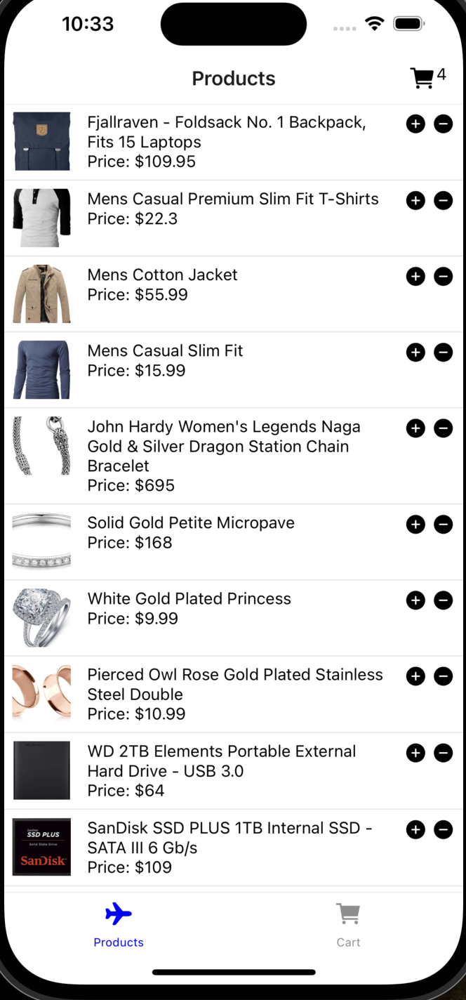

# Expo Router and Tailwind CSS

Use [Expo Router](https://docs.expo.dev/router/introduction/) with [Nativewind](https://www.nativewind.dev/v4/overview/) styling.

## 🚀 How to use

```sh
npx create-expo-app -e with-router-tailwind
```

## **Preview**

```
span
```

<div style="display:flex;gap:16px;">


</div>
